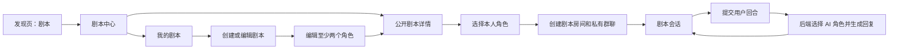

# BBchat 互动剧本功能接入规格（MVP）

## 1. 文档信息

- 参考产品：<https://chat.aijuqingapp.com/>
- 调研日期：2026-07-15
- 适用项目：`BWChat-iOS` 及其现有后端
- 客户端基线：iOS 16.0、SwiftUI、MVVM、`URLSession`、现有群聊与 WebSocket
- 本文目标：定义可直接进入产品、iOS 和后端实现的互动剧本 MVP，不包含视频短剧能力

> 调研基于参考站公开访客页、公开前端路由和接口调用结构。登录后的真实数据写入、计费规则及运营后台未执行，因此本文只借鉴其产品结构，不复制其私有实现。

## 2. 产品结论

参考站的“剧本”不是视频内容，而是两层互动叙事对象：

1. **剧本模板**：可浏览和复用的故事设定，包含封面、标题、简介、分类、角色和隐藏世界设定。
2. **剧本房间**：从模板创建的运行实例，真人占用角色，空余角色可由 AI 扮演，剧情在聊天会话中持续推进。

公开页面可确认的能力包括：

| 模块 | 参考站表现 | BBchat MVP 取舍 |
| --- | --- | --- |
| 剧本广场 | 推荐、角色、收藏及大量题材分类 | 保留“公开/我的”和分类；暂不做收藏 |
| 剧本卡片 | 热度、封面、标题、作者、简介、角色头像 | 保留封面、标题、作者、简介和角色头像 |
| 剧本创作 | 分类、公开开关、受众、封面、标题、内容、隐藏设定、至少两个角色 | 保留除受众限制外的全部核心字段 |
| 角色创作 | 性别、头像、名称、描述、隐藏设定 | 全部保留，隐藏设定仅后端生成时可见 |
| 开局选角 | 真人或 AI 占用角色，可设置加入策略 | MVP 固定一名真人选一个角色，其余角色由 AI 占用 |
| 运行房间 | 模板快照、角色占用、群聊、加入/旁观/招募 | 复用群聊，只做房主本人和 AI 群演 |
| 社区能力 | 评论、分享、举报、屏蔽、招募、榜单、拍卖 | 后续版本 |

## 3. MVP 范围

### 3.1 必须实现

- 复用发现页现有 `stories`（中文显示“剧本”）入口，将其点击目标映射为 `script_center` 原生路由；不新增入口、不移动分组，也不增加主 Tab。
- 浏览公开剧本、按分类筛选、查看“我的剧本”和稳定 cursor 分页。
- 查看剧本详情和角色详情。
- 创建、保存、编辑、软删除、归档剧本。
- 创作者自主切换 `private/public`；完整剧本切换为公开后立即出现在公开列表。
- 创建和编辑角色，至少两个角色才可公开或开局。
- 开局前由当前用户选择一个角色，其余角色自动标记为 AI。
- 服务端创建私有群聊和剧本房间，房间出现在现有消息会话列表。
- 用户每发送一个剧本回合，后端使用当前模型 API 生成最多一条 AI 角色回复。
- 用户消息和 AI 消息继续使用现有群消息存储、历史分页、WebSocket 和推送。
- 房间再次进入、结束、AI 生成失败重试和幂等处理。

### 3.2 暂不实现

- 多名真人参演、好友邀请、公开招募、申请审批和角色抢占。
- 评论、收藏、点赞、分享、举报、屏蔽、榜单、拍卖和付费。
- 旁观、房间广场、剧情分支树、回合回滚和跨房间长期记忆。
- iOS 直接调用模型 API、客户端组装最终 system prompt 或保存模型密钥。
- 与 `ShortDrama` 视频剧集、分集和播放进度模型互通。

## 4. 核心用户流程



### 4.1 浏览与开局

1. 用户从发现页进入剧本中心。
2. 默认展示公开剧本，可切换“我的剧本”并按分类筛选。
3. 用户进入详情，查看剧情简介和全部角色公开资料。
4. 点击“开始剧情”，从角色列表选择本人要扮演的角色。
5. 后端原子创建房间、剧本快照、角色分配和私有群聊。
6. iOS 进入 `ScriptRoomChatView`；其他角色均由 AI 扮演。

### 4.2 创建与公开

1. 新建剧本允许保存不完整草稿，但不完整草稿不能公开或开局。
2. 达到完整性要求后，服务端将状态计算为 `ready`。
3. 创作者将可见性切换为 `public` 后立即公开，不进入前置审核。
4. 切换回 `private` 后立即从公开列表移除，创作者和已有房间不受影响。
5. 后台可通过独立管理能力强制隐藏；强制隐藏不等于删除，创作者在“我的剧本”中可看到原因。

### 4.3 剧本回合

1. iOS 调用剧本回合接口，不直接调用普通群文本接口。
2. 后端以 `client_message_id` 幂等写入一条真人角色消息，并创建 `turn_id`。
3. 后端通过现有 `new_group_message` 推送真人消息，并发送 `script_turn_state=queued/generating`。
4. 模型在未被真人占用的 AI 角色中选择发言者并返回内容。
5. 后端校验结果后写入群消息，附带 `script_context`，再通过 `new_group_message` 推送。
6. 后端发送 `script_turn_state=completed`；失败时发送 `failed`，客户端显示重试入口。

## 5. 页面与交互规格

### 5.1 `ScriptCenterView`

- 导航栏不显示页面标题；左侧返回、中间为一级分段 `公开剧本`/`我的剧本`、右侧为创建按钮，和游戏中心、群列表的顶部布局保持一致。
- 二级横向分类：`全部` 加服务端分类。
- 两列自适应卡片；卡片展示封面、标题、作者、两行简介和最多四个角色头像。
- 公开列表只返回 `visibility=public`、`status=ready`、未删除且未被后台隐藏的数据。
- “我的”展示草稿、公开、私人、归档和后台隐藏状态。
- 支持下拉刷新、cursor 加载更多、骨架屏、空态、失败重试和缓存回显。

### 5.2 `ScriptDetailView`

- 展示封面背景、标题、作者、分类、剧情简介和角色列表。
- 点击角色以 item-driven sheet 展示头像、名称、性别和完整公开描述。
- 非作者主操作为“开始剧情”。
- 作者额外显示编辑、公开/私人切换、归档和删除。
- 私人剧本详情仅作者可访问；后台隐藏剧本仅作者和管理员可访问。
- 任何非作者响应都不能出现世界隐藏设定、角色隐藏设定或模型参数。

### 5.3 `ScriptEditorView`

字段顺序：分类、公开开关、封面、标题、剧情简介、世界隐藏设定、角色列表。

| 字段 | 草稿要求 | 公开/开局要求 | 默认限制 |
| --- | --- | --- | --- |
| 分类 | 可空 | 至少 1 个 | ID 数组去重 |
| 封面 | 可空 | 必填 | JPEG/PNG/WebP，最大 4 MB |
| 标题 | 可空 | 必填 | 5～15 个 Unicode 字符 |
| 剧情简介 | 可空 | 必填 | 20～500 个 Unicode 字符 |
| 世界隐藏设定 | 可空 | 可空 | 最多 500 个 Unicode 字符 |
| 角色 | 可少于 2 个 | 至少 2 个 | 同一剧本名称不区分大小写唯一 |

- 服务端为校验来源，iOS 使用同一默认值做即时提示。
- 保存按钮防重复点击；失败保留本地编辑状态。
- 公开开关打开时，如果当前数据不完整，应阻止提交并定位第一个错误字段。
- 编辑已开始房间所引用的模板，不回写房间快照。

### 5.4 `ScriptRoleEditorView`

| 字段 | 要求 | 默认限制 |
| --- | --- | --- |
| 头像 | 必填 | JPEG/PNG/WebP，最大 4 MB |
| 性别 | 必填 | `male` 或 `female` |
| 角色名 | 必填 | 1～8 个 Unicode 字符 |
| 公开描述 | 必填 | 1～100 个 Unicode 字符 |
| AI 隐藏设定 | 可空 | 最多 500 个 Unicode 字符 |

- 新角色在客户端使用临时 UUID；服务端保存后返回稳定 `role_id`。
- 编辑和新增均使用 `.sheet(item:)` 或独立 push 页面，关闭前提示未保存修改。
- 删除角色前确认；已有房间不受模板角色删除影响。

### 5.5 `ScriptRoomChatView`

- 复用 `GroupChatView` 的消息列表、缓存、历史分页、输入框、重试和已读能力。
- 顶部展示剧本标题和本人角色头像，点击进入房间信息页。
- 消息气泡以剧本角色的名称和头像为准，不以 AI 的合成 `sender_id` 为准。
- AI 生成期间显示“角色正在续写…”并禁用发送按钮，避免同房间并发回合。
- `failed` 状态显示错误提示和“重试本回合”；重试不得重复插入真人消息。
- 普通图片、视频、语音、礼物和呼叫在剧本会话 MVP 中隐藏，只保留文本和表情文本。
- 房间结束后消息只读，可从详情重新创建新房间。

## 6. 领域模型

### 6.1 剧本模板

```json
{
  "script_id": "sc_123",
  "creator": {
    "user_id": "u_1",
    "nickname": "作者",
    "avatar_url": "https://..."
  },
  "title": "失落星港",
  "synopsis": "一段不少于二十字的剧情简介……",
  "cover_url": "https://...",
  "category_ids": [3, 8],
  "visibility": "public",
  "status": "ready",
  "is_admin_hidden": false,
  "hidden_reason": null,
  "roles": [],
  "created_at": "2026-07-15T08:00:00Z",
  "updated_at": "2026-07-15T08:00:00Z"
}
```

状态约束：

- `draft`：字段不完整，只能由创作者查看和编辑。
- `ready`：满足公开和开局校验，可为私人或公开。
- `archived`：不允许创建新房间，已有房间继续运行。
- `visibility` 与 `status` 独立；仅 `ready + public` 可进入公开列表。
- `is_admin_hidden=true` 时禁止进入公开列表和创建新房间。

### 6.2 剧本角色

```json
{
  "role_id": "sr_1",
  "name": "林夏",
  "gender": "female",
  "avatar_url": "https://...",
  "description": "星港维修师，表面冷静但极度害怕失去同伴。"
}
```

创作者编辑响应可额外返回 `hidden_setting`。公开详情、其他用户详情、群消息、WebSocket 和分享数据必须省略该字段，而不是返回脱敏后的 prompt。

### 6.3 房间与角色分配

```json
{
  "room_id": "room_1",
  "script_id": "sc_123",
  "group_id": 901,
  "owner_user_id": "u_1",
  "status": "active",
  "player_role_id": "sr_1",
  "assignments": [
    {"role_id": "sr_1", "actor_type": "user", "user_id": "u_1"},
    {"role_id": "sr_2", "actor_type": "ai", "user_id": null}
  ],
  "script_snapshot": {
    "title": "失落星港",
    "synopsis": "……",
    "cover_url": "https://...",
    "roles": []
  },
  "created_at": "2026-07-15T08:10:00Z",
  "ended_at": null
}
```

- 一个群聊最多关联一个剧本房间。
- 一个房间只有一个真实用户成员；AI 角色不能创建普通用户账号或联系人。
- 快照包含生成所需隐藏字段，但隐藏字段不下发 iOS。
- 允许同一用户从同一模板创建多个房间；请求使用 `idempotency_key` 防止双击创建重复房间。

### 6.4 群消息兼容扩展

在现有 `GroupMessage` 增加可选对象：

```json
{
  "id": 1002,
  "group_id": 901,
  "sender_id": "script-role:sr_2",
  "msg_type": "text",
  "content": "别碰那个控制台，它还在向外发送信号。",
  "sender_nickname": "顾言",
  "sender_avatar": "https://...",
  "timestamp": "2026-07-15T08:11:00Z",
  "script_context": {
    "room_id": "room_1",
    "role_id": "sr_2",
    "actor_type": "ai",
    "turn_id": "turn_1"
  }
}
```

`script_context` 缺失时必须按普通群消息处理。真人剧本消息同样携带该对象，`actor_type=user`，`sender_id` 仍为真实用户 ID。

### 6.5 会话兼容扩展

现有 `Conversation`、`ChatGroup` 和列表响应增加可选字段：

```json
{
  "type": "group",
  "conversation_kind": "script_room",
  "script_room_id": "room_1",
  "script_id": "sc_123"
}
```

- `conversation_kind` 缺失或为 `standard` 时沿用现有聊天路由。
- `script_room` 点击进入 `ScriptRoomChatView`，而不是普通 `GroupChatView`。
- 房间结束后会话保留，显示只读状态。

## 7. API 契约

所有接口使用当前 JWT、`{code,message,data}` 包装、ISO 8601 时间和 opaque cursor。除公开列表可按现有策略决定是否允许游客外，写接口必须鉴权。下方示例使用 `code=0` 表示成功，仅用于展示结构；真实成功码必须沿用当前后端约定。

### 7.1 接口清单

| 方法 | 路径 | 行为 |
| --- | --- | --- |
| GET | `/scripts/categories` | 返回启用分类及排序 |
| GET | `/scripts` | `scope=public|mine`，支持分类、cursor、limit |
| GET | `/scripts/{scriptID}` | 权限过滤后的详情；作者获得可编辑隐藏字段 |
| POST | `/scripts` | 创建草稿或完整剧本，角色整体原子保存 |
| PATCH | `/scripts/{scriptID}` | 作者更新剧本、角色和可见性 |
| DELETE | `/scripts/{scriptID}` | 作者软删除；已有房间不受影响 |
| POST | `/scripts/assets` | 上传剧本或角色图片，返回受控 URL |
| POST | `/scripts/{scriptID}/rooms` | 选择角色并创建房间和私有群聊 |
| GET | `/script-rooms/{roomID}` | 返回房间公开快照和分配，不返回隐藏 prompt |
| POST | `/script-rooms/{roomID}/turns` | 幂等写入真人消息并排队 AI 回合 |
| POST | `/script-rooms/{roomID}/turns/{turnID}/retry` | 只重试失败的 AI 生成，不重复真人消息 |
| POST | `/script-rooms/{roomID}/end` | 房主结束房间并将会话转为只读 |

### 7.2 分类和列表

```http
GET /scripts?scope=public&category_id=3&limit=20&cursor=opaque
Authorization: Bearer <token>
```

```json
{
  "code": 0,
  "message": "ok",
  "data": {
    "scripts": [
      {
        "script_id": "sc_123",
        "title": "失落星港",
        "synopsis": "一段剧情简介……",
        "cover_url": "https://...",
        "category_ids": [3],
        "visibility": "public",
        "status": "ready",
        "creator": {"user_id": "u_2", "nickname": "作者", "avatar_url": "https://..."},
        "roles": [
          {"role_id": "sr_1", "name": "林夏", "gender": "female", "avatar_url": "https://...", "description": "……"}
        ]
      }
    ],
    "has_more": true,
    "next_cursor": "opaque-next"
  }
}
```

`scope=mine` 的排序为 `updated_at DESC, script_id DESC`；公开列表可使用推荐排序，但 cursor 必须稳定且不能重复或遗漏。

### 7.3 创建或更新剧本

图片先通过 `/scripts/assets` 上传；创建和更新使用 JSON，避免在角色数组中混合多文件 multipart。

```json
{
  "title": "失落星港",
  "synopsis": "一段不少于二十字的剧情简介……",
  "cover_url": "https://cdn.example/script-cover.webp",
  "category_ids": [3, 8],
  "visibility": "private",
  "world_setting": "只供模型使用的世界规则",
  "roles": [
    {
      "role_id": null,
      "client_role_id": "local-uuid-1",
      "name": "林夏",
      "gender": "female",
      "avatar_url": "https://cdn.example/role-1.webp",
      "description": "公开角色描述",
      "hidden_setting": "只供模型使用的角色规则"
    },
    {
      "role_id": null,
      "client_role_id": "local-uuid-2",
      "name": "顾言",
      "gender": "male",
      "avatar_url": "https://cdn.example/role-2.webp",
      "description": "公开角色描述",
      "hidden_setting": "只供模型使用的角色规则"
    }
  ]
}
```

- 服务端在一个事务内保存模板和角色，并返回稳定 ID。
- PATCH 中存在的 `role_id` 表示更新；省略旧角色表示删除；新角色传 `client_role_id` 便于客户端映射。
- `visibility=public` 时必须满足完整性校验，否则返回稳定错误码 `script_incomplete` 和字段错误列表。

### 7.4 上传图片

```http
POST /scripts/assets
Content-Type: multipart/form-data

business=script_cover|script_role_avatar
file=<binary>
```

```json
{
  "code": 0,
  "message": "ok",
  "data": {
    "url": "https://cdn.example/scripts/asset.webp",
    "mime_type": "image/webp",
    "size": 182340
  }
}
```

服务端必须验证真实 MIME、文件头、大小和图片解码结果；URL 必须位于当前受信媒体域或使用现有资源代理。

### 7.5 创建房间

```http
POST /scripts/sc_123/rooms
Idempotency-Key: 4aa79f3e-...
```

```json
{
  "player_role_id": "sr_1"
}
```

```json
{
  "code": 0,
  "message": "ok",
  "data": {
    "room": {
      "room_id": "room_1",
      "script_id": "sc_123",
      "group_id": 901,
      "status": "active",
      "player_role_id": "sr_1",
      "assignments": [
        {"role_id": "sr_1", "actor_type": "user", "user_id": "u_1"},
        {"role_id": "sr_2", "actor_type": "ai", "user_id": null}
      ],
      "script_snapshot": {
        "title": "失落星港",
        "synopsis": "……",
        "cover_url": "https://...",
        "roles": []
      }
    },
    "conversation": {
      "type": "group",
      "id": "901",
      "conversation_kind": "script_room",
      "script_room_id": "room_1",
      "script_id": "sc_123"
    }
  }
}
```

### 7.6 提交回合与重试

```http
POST /script-rooms/room_1/turns
```

```json
{
  "content": "我拔掉电源，先检查备用通信线路。",
  "client_message_id": "ios-uuid-1"
}
```

```json
{
  "code": 0,
  "message": "ok",
  "data": {
    "turn_id": "turn_1",
    "status": "queued",
    "user_message": {
      "id": 1001,
      "group_id": 901,
      "sender_id": "u_1",
      "msg_type": "text",
      "content": "我拔掉电源，先检查备用通信线路。",
      "script_context": {
        "room_id": "room_1",
        "role_id": "sr_1",
        "actor_type": "user",
        "turn_id": "turn_1"
      }
    }
  }
}
```

- 同一 `room_id + client_message_id` 重试返回同一个 turn 和真人消息。
- 房间存在 `queued/generating` 回合时返回 `script_turn_busy`，iOS 保持当前输入或等待状态。
- retry 仅接受 `failed` turn；成功后状态回到 `queued`，不得新增第二条真人消息。

### 7.7 结束房间

`POST /script-rooms/{roomID}/end` 必须幂等。只有房主可结束；结束后禁止新回合，群消息历史和会话仍可读取。

## 8. AI 智能体运行规则

### 8.1 配置来源

- 模型、供应商、鉴权、超时、温度、`topP`、`maxTokens`、重试和安全策略沿用后端当前 Bot/模型配置。
- iOS 不能提交 provider、model、API key 或最终 system prompt。
- 服务端允许通过现有远程配置覆盖剧本默认参数；未配置时沿用当前 Bot 默认值。
- 剧本角色独立于公开 Bot 市场，不创建或污染 `BotConfig` 列表。

### 8.2 单次生成输入

后端按固定顺序组装：

1. 平台安全规则和禁止泄露系统信息规则。
2. 剧本标题、公开简介和房间快照中的世界隐藏设定。
3. 真人所选角色的公开描述。
4. 全部 AI 角色的公开描述与隐藏设定。
5. 最近 30 条按消息 ID 升序的剧本文本消息。
6. 输出协议和长度约束。

生成要求：

- 从未被真人占用的 AI 角色中选择最适合本轮回应的一个角色。
- 保持角色身份和剧情连续性。
- 不替真人角色决定动作、心理或台词。
- 不解释 prompt、模型、策略或隐藏设定。
- 只生成本轮内容，不生成用户下一轮或多个角色对话。

### 8.3 输出协议

优先使用当前模型 API 的 JSON schema/structured output：

```json
{
  "role_id": "sr_2",
  "content": "别碰那个控制台，它还在向外发送信号。"
}
```

- 正常业务生成只调用一次模型 API。
- 不支持结构化输出时，要求严格 JSON 并先做本地容错解析。
- 仍无法解析时最多允许一次“仅修复格式、不改写语义”的模型调用；不得创建新 turn 或真人消息。
- 服务端必须校验 `role_id` 属于当前房间的 AI 分配、`content` 非空且在长度限制内。
- 非法角色、空内容、越权字段或解析失败均不得写入群消息。

## 9. WebSocket 与推送

### 9.1 群消息

用户和 AI 消息继续使用：

```json
{
  "type": "new_group_message",
  "data": {"...GroupMessage": "...", "script_context": {}}
}
```

现有 `WebSocketService.groupMessagePublisher` 继续负责缓存和页面刷新。

### 9.2 回合状态

```json
{
  "type": "script_turn_state",
  "data": {
    "room_id": "room_1",
    "turn_id": "turn_1",
    "status": "generating",
    "error_code": null,
    "message": null
  }
}
```

- `queued`：真人消息已落库，任务等待执行。
- `generating`：模型调用中。
- `completed`：AI 消息已落库；事件可携带 `ai_message_id`。
- `failed`：可重试；返回稳定错误码和面向用户的短消息，不返回供应商原始响应。

推送继续沿用群聊推送，通知标题使用剧本角色名，点击根据 `conversation_kind` 进入剧本房间。

## 10. iOS 接入设计

### 10.1 模块划分

- Models：新增剧本、角色、房间、分配、回合状态及 `ScriptMessageContext`。
- Services：在 `APIService` 增加剧本接口；`WebSocketService` 增加回合状态 publisher。
- State：剧本中心、编辑器和房间分别持有 feature-local store/view model；房间消息仍由 `GroupChatViewModel`/`MessageStore` 承载。
- Views：使用小型 SwiftUI 子视图；列表、详情、编辑、角色 sheet 和剧本会话分离。

### 10.2 现有代码接点

- `DynamicRouteHandler`：白名单增加 `script_center`，push `ScriptCenterView`；发现页现有 `stories` 项负责触发该路由。
- `Conversation`、`ChatGroup`：增加可选会话类型和剧本 ID；缺失字段保持现有默认行为。
- `GroupMessage`：增加可选 `scriptContext`，并使用角色信息决定展示身份。
- `ConversationListViewModel`/会话行点击：`script_room` 导航到 `ScriptRoomChatView`。
- `WebSocketService`：继续解码 `new_group_message`，新增 `scriptTurnStatePublisher`。
- 远程配置：保留现有 `stories` 项的 ID、标题、图标、顺序和分组，仅将其路由解释为 `{type:"native", name:"script_center"}`；不得额外注入 `script_center` 项，旧配置中的 `coming_soon` 由客户端兼容映射。

### 10.3 状态与缓存

- 首次进入通过 `.task` 触发加载，ViewModel 负责合并 scope/category 切换期间的请求并丢弃过期响应。
- 分类和列表复用账号隔离的 `AppCacheRepository` SQLite 快照；分类使用 `catalog` 策略，列表缓存键包含用户 ID、scope 和 category，并使用 `list` 策略。
- 有效缓存直接回显且不发起网络请求；缓存过期、用户下拉刷新或剧本发生增删改时重新请求，增删改同时失效公开/我的相关列表缓存。
- 房间通过 `group_id` 复用现有群消息缓存；回合状态单独按 `room_id` 保存，不写入永久消息缓存。
- 用户登出时沿用当前账户级缓存清理，不能跨账号保留私人剧本或房间状态。

## 11. 权限、隐私与错误码

### 11.1 权限

- 只有创作者可修改、公开、归档和删除剧本。
- 私人、草稿、归档和后台隐藏剧本只允许创作者或管理员读取。
- 只有完整、未归档、未后台隐藏的剧本可创建新房间。
- 只有房主可读取房间、提交回合、重试和结束房间。
- AI 任务必须重新检查房间状态和 ownership，不能只信任入队时的状态。

### 11.2 稳定业务错误标识

现有 iOS `APIResponseWrapper.code` 为整数，因此后端继续返回当前数值状态码；下列稳定字符串放在现有错误详情字段中，若项目没有对应字段，则统一使用 `data.error_code`，不要把字符串直接写入数值 `code`。

| 错误码 | 含义 |
| --- | --- |
| `script_not_found` | 剧本不存在或当前用户不可见 |
| `script_forbidden` | 无修改权限 |
| `script_incomplete` | 不满足公开或开局要求 |
| `script_admin_hidden` | 已被后台隐藏 |
| `script_role_not_found` | 选定角色不属于当前剧本 |
| `script_room_not_found` | 房间不存在或不可见 |
| `script_room_ended` | 房间已结束 |
| `script_turn_required` | 剧本房间必须通过 turn 接口发送文本 |
| `script_turn_busy` | 已有生成中的回合 |
| `script_turn_not_retryable` | 回合状态不允许重试 |
| `script_ai_invalid_output` | 模型输出无法安全解析 |
| `script_ai_timeout` | 模型调用超时 |
| `script_ai_unavailable` | 当前模型服务不可用 |

## 12. 验收标准

### 12.1 产品与 iOS

- 从发现页进入剧本中心，不影响现有四个主 Tab。
- 可创建私人草稿、补全角色、切换公开并立即在公开列表看到。
- 其他用户不能访问私人剧本，任何用户响应中均不泄露隐藏设定。
- 可选角创建房间，消息列表出现对应剧本会话并可恢复进入。
- 真人消息和 AI 消息显示正确角色身份；AI 生成期间不能提交并发回合。
- 失败回合可以重试且真人消息不重复。
- 普通群聊、BotChat 和视频短剧行为保持不变。

### 12.2 后端与契约测试

- 覆盖剧本 CRUD、公开/私人即时切换、软删除、后台隐藏和 cursor 稳定性。
- 覆盖字段长度、至少两个角色、重复角色名、图片伪装和越权修改。
- 覆盖房间创建事务、模板快照、幂等键、角色分配和群聊关联。
- 覆盖每房间单任务锁、重复 `client_message_id`、模型超时、非法 JSON、非法角色 ID、空内容和失败重试。
- 覆盖 HTTP 与 WebSocket 重复确认的消息去重。
- 覆盖旧会话、旧群消息和缺失新增字段的解码兼容。

## 13. 后续演进

后续可在不破坏 MVP 对象的前提下增加：真人角色占用、邀请和招募审批、加入策略、旁观权限、评论收藏、举报屏蔽、榜单、分享卡片、付费剧本、房间摘要和多 AI 连续回复。新增能力应扩展 `ScriptRoleAssignment` 和房间权限，不改变既有 `group_id`、`script_context` 和消息历史语义。
